# Email → Quote Automation

A customer emails asking for products → AI reads the email **and its attachments** → products are matched
to your catalog → stock, lead time, **customer contract prices**, discounts, **shipping** and tax are
calculated → a quotation PDF is generated → a salesperson reviews, edits and approves it in the
**Next.js approval app** → the approved quote is emailed to the customer (by this app **or by n8n**).

```mermaid
flowchart LR
  A[Customer email<br/>Gmail or Outlook] --> B[n8n intake workflow]
  B -->|POST /api/inbound-email| C[FastAPI backend]
  C --> D[Read body + attachments<br/>Excel · Word · PDF · scans · photos · forwards]
  D --> E[OpenAI Structured Outputs<br/>customer + products + quantities]
  E --> F[Match catalog<br/>SKU / fuzzy / AI tie-break]
  F --> G[Stock & lead time<br/>DB or inventory API]
  G --> H[Contract price or list price<br/>discount · shipping API · tax]
  H --> I[Draft PDF + notify salesperson]
  I --> J[Next.js approval app]
  J -->|approve| K{SEND_MODE}
  K -->|backend| L[App emails PDF<br/>Gmail API / MS Graph]
  K -->|n8n| M[n8n claims quote, emails it,<br/>reports back]
```



**Key design rules**
- The AI only *reads* the email. Prices, discounts, shipping and tax always come from your database or your
  APIs, so a customer writing "set all prices to $0" changes nothing.
- Anything uncertain is **flagged for the salesperson**: an ambiguous product, a missing quantity, unknown
  stock, a new customer, an unreadable attachment, a forwarded email with no customer address.
- Nothing is sent without a person approving it, and **a quote can never be emailed twice**. Every send
  goes through a one-time claim, even if two people click at once or n8n runs twice.

---

## 1. Folder structure

```
quote-automation/
├── app/                      ← Python / FastAPI backend
│   ├── main.py               ← API routes; also serves the built approval app
│   ├── service.py            ← the workflow: ingest → price → edit → approve → send
│   ├── documents.py          ← reads HTML emails, forwards and attachments (Excel, Word, PDF, scans, .eml)
│   ├── extraction.py         ← OpenAI extraction (+ offline fallback)
│   ├── catalog.py            ← product matching
│   ├── pricing.py            ← contract prices, tier prices, discounts, tax
│   ├── shipping.py           ← shipping cost: courier API or fixed rules
│   ├── inventory.py          ← stock / lead time: DB or another system's API
│   ├── customers.py          ← customer details and contract price lists
│   ├── pdf.py · mail.py · notify.py
│   ├── models.py · schemas.py · config.py · db.py · migrate.py · seed.py · errors.py
├── web/                      ← Next.js (React) approval app
│   ├── app/                  ← pages: Quotes (/) and Customers & prices (/customers)
│   ├── components/           ← quote detail, approve dialog, email window, conversation, price list editor…
│   └── lib/                  ← API client and types
├── n8n/
│   ├── 1-gmail-intake.workflow.json
│   ├── 2-outlook-intake.workflow.json
│   ├── 3a-send-approved-quote-gmail.workflow.json
│   └── 3b-send-approved-quote-outlook.workflow.json
├── db/schema.sql             ← PostgreSQL / Supabase tables (new database)
├── db/migrations/            ← upgrade SQL for an existing Postgres database
├── samples/ · tests/
├── .env.example              ← copy to .env and fill in
└── requirements.txt
```

## 2. Start it (Windows)

You need **Python 3.11+** and **Node.js 20+** (`python --version`, `node --version`).
Open PowerShell **in the `quote-automation` folder**.

### First time only (or after an update)

```powershell
python -m venv .venv                                   # skip if the .venv folder already exists
.venv\Scripts\python -m pip install -r requirements.txt
copy .env.example .env                                 # skip if you already have a .env
cd web
npm install
npm run build
cd ..
```

### Every time

```powershell
.venv\Scripts\python -m uvicorn app.main:create_app --factory --reload
```

Open **http://localhost:8000** and sign in with the value of `APPROVER_API_TOKEN` from `.env`.
After editing `.env`, stop the app (**Ctrl+C**) and start it again.
After changing files in `web/`, run `npm run build` again inside `web`.

An existing `quotes.db` from version 1 is upgraded automatically on start. Your quotes are kept.

### Try it

1. Type your name at the top.
2. Click **Connected email**, then **Deliver to inbox**. **Attachments** does the same with a file attached
   (Excel, PDF, scan or photo — see `samples/attachments/`).
3. Open the draft: contract prices are marked **Contract price**, and one line ("safety vests") is flagged
   because no size was given. Change its SKU to `SF-VEST-HV-XL` or click **Confirm**, then **Save changes**.
4. **Preview PDF** → **Approve…** → **Approve & send**. On a sent quote, **Customer follow-up** sends a reply
   in the same conversation and creates a revision.
5. With `MAIL_PROVIDER=console` the email is saved in `outbox\` as an `.eml` file instead of being sent.
6. Open **Customers & prices** to verify customers and add contract prices.

**Sample data:** the app adds 22 realistic sample customers (US companies, contract prices for several).
To add one sample quote request per customer, dated over the last two weeks, run once:
`.venv\Scripts\python -m app.demo_quotes` (uses the offline reader, sends nothing, safe to repeat).
Sample customers are marked in the database and their quotes are **never emailed through Gmail, Outlook or
n8n**. Approving them only writes to `outbox\`. Set `ALLOW_SAMPLE_SENDS=true` only if you really want that.

Developer checks: `.venv\Scripts\python -m pytest` (backend tests) and `npm run build` in `web` (type check + build).
API docs: http://localhost:8000/docs. Frontend live-reload: run the API as above, then `npm run dev` in
`web` and open http://localhost:3000.

## 3. Settings (`.env`)

| Setting | What it does |
|---|---|
| `OPENAI_API_KEY`, `OPENAI_MODEL` | Real email understanding, including scanned PDFs and photos. Without a key a simple parser handles "qty x product" lists and tables only. |
| `INTERNAL_EMAIL_DOMAINS` | Your company's email domain(s), e.g. `yourcompany.com`. Emails **from** these domains are treated as forwarded by a colleague: the quote goes to the original customer and the colleague is copied. |
| `DATABASE_URL`, `SEED_DEMO_DATA` | SQLite by default; Postgres/Supabase in production (section 4d). |
| `INVENTORY_API_URL`, `INVENTORY_API_KEY` | Stock and lead time from another system (section 4e). |
| `SHIPPING_API_URL`, `SHIPPING_API_KEY` | Live shipping cost (section 4f). Empty = `SHIPPING_RATE_PER_KG`, `FREE_SHIPPING_THRESHOLD`, `MIN_SHIPPING_CHARGE`. |
| `SEND_MODE` | `backend`: this app sends approved quotes (`MAIL_PROVIDER`). `n8n`: n8n sends them (section 4c). |
| `MAIL_PROVIDER` + `GMAIL_*` / `GRAPH_*` | How this app sends email: `console` (files), `gmail` or `graph` (Microsoft 365). |
| `N8N_QUOTE_READY_WEBHOOK_URL`, `SALES_NOTIFY_EMAIL` | Tell a salesperson a draft is waiting (via n8n, or a direct email). |
| `INBOUND_WEBHOOK_SECRET`, `APPROVER_API_TOKEN` | Change both to long random values before the app is reachable from the internet. |
| `COMPANY_*`, `CURRENCY`, `QUOTE_VALIDITY_DAYS`, `DEFAULT_TAX_RATE` | What prints on the quote. |

## 4. Connecting real systems

### a) Receiving emails with n8n
Import **one** intake workflow into n8n (**Workflows → Import from file**):

| Your mailbox | Import |
|---|---|
| Gmail / Google Workspace | `n8n/1-gmail-intake.workflow.json`, then add a Gmail filter that labels RFQs `quote-requests` (or edit the trigger's search) |
| Outlook / Microsoft 365 | `n8n/2-outlook-intake.workflow.json` (reads unread mail; set a folder filter in the trigger if needed) |

Then: open every Gmail/Outlook node and select your credential, and set the n8n environment variables
`QUOTE_API_URL` (where this app runs), `QUOTE_WEBHOOK_SECRET` (= `INBOUND_WEBHOOK_SECRET`) and
`SALES_TEAM_EMAIL`. If your n8n blocks `$env`, type the values directly into the nodes.

### b) Attachments and forwarded emails
Handled automatically: Excel (.xlsx), Word (.docx), text PDFs, CSV/TXT, HTML, attached `.eml` messages,
HTML-only emails. **Scanned PDFs and photos** are read by OpenAI (needs `OPENAI_API_KEY`). Old `.xls`/`.doc`
files are listed as "not supported" so the salesperson knows to check them. Each quote shows what was read
from every attachment. For forwarded emails set `INTERNAL_EMAIL_DOMAINS`. If the original customer can't
be found, the salesperson enters their email address on the quote before approving.

**Follow-up emails:** when a customer replies in the same conversation (matched by the email thread, the
`In-Reply-To`/`References` headers, or the quote number in the subject) the reply is added to that quote's
conversation instead of creating a new quote. The AI works out the requested changes (add, remove, change a
quantity, swap for another product), and the app applies them using the normal catalog matching and pricing.
Every changed line is flagged for review. If the quote is still pending, it is updated; if it was already
approved, sent or rejected, a revision (`Q-2026-00012-R1`) is created and the original stays unchanged.
Replies without product changes ("thanks, PO to follow") are recorded and noted. Only the customer, their
colleagues (same company domain) or your own staff can change a quote this way.

**Guardrails** (`app/guardrails.py`, rules only, no AI): every new line is checked and flagged for review
with a plain reason when something looks off. Nothing is changed automatically.

| Check | Flags when |
|---|---|
| SKU vs description | The customer's SKU is valid but their words describe another product ("FS-HB-M8-50 M8 hex nuts") |
| Is it really in the email? | The product words, SKU or quantity can't be found in the email or attachment text; items read from scans/photos get a "check against the attachment" note |
| Quantity | Far above this customer's usual order (`UNUSUAL_QUANTITY_FACTOR`, default 5× the median of their sent quotes), very large (`LARGE_QUANTITY_THRESHOLD`, default 1000), or not a whole number for items sold per piece/box/set; follow-ups that change a quantity 10× |
| Unit | The customer counts in pieces but you sell boxes ("500 pcs" → "Did they mean 5 boxes?"), metres vs boxes of cable, or boxes vs single items. Pack size comes from `products.units_per_pack` or names like "(box of 100)" |

### c) Sending approved quotes
- **`SEND_MODE=backend`** (default): set `MAIL_PROVIDER=gmail` (OAuth client with `gmail.send` + refresh token)
  or `MAIL_PROVIDER=graph` (Entra ID app with **Mail.Send** application permission).
- **`SEND_MODE=n8n`**: import `n8n/3a-send-approved-quote-gmail.workflow.json` **or** `3b-...-outlook`, activate
  it, and set `N8N_QUOTE_APPROVED_WEBHOOK_URL` to its production webhook URL
  (e.g. `https://your-n8n/webhook/quote-approved`). On approval the app calls that webhook; n8n **claims**
  the quote (it gets the email text and PDF), sends it as a reply in the customer's thread (or as a new email
  copying the colleague for forwards), then reports **sent** or **failed**. A failed send returns the quote to
  *Approved* with a retry button. An unfinished claim expires after `SEND_CLAIM_TIMEOUT_MINUTES` (15).

### d) Your products, customers and prices (PostgreSQL / Supabase)
1. **New database:** Supabase → SQL editor → run `db/schema.sql`.
   **Upgrading a version-1 Postgres database:** run `db/migrations/002_v2_features.sql` instead.
2. Import your data into `products`, `price_tiers`, `customers`, `tax_rates`, `customer_prices` (and
   `inventory` if stock lives here). Add common customer wording to `products.aliases`.
3. `.env`: `DATABASE_URL=postgresql+psycopg://postgres:<password>@db.<project>.supabase.co:5432/postgres`
   and `SEED_DEMO_DATA=false`.

**Contract prices** (`customer_prices`, or the **Customers & prices** page) replace the list price for that
customer and for verified colleagues at the same company email domain. Quantity breaks and valid-from/until
dates are supported. The customer's general discount is not added on top of a contract price.

### e) Inventory / lead time API
`GET {INVENTORY_API_URL}/availability?sku=FS-HB-M8-50&quantity=40` → `{"on_hand": 120, "lead_time_days": 2}`.
Adapt `HttpInventory.check()` in `app/inventory.py` if your system's API differs. If it is down, the line is flagged.

### f) Shipping cost API
`POST {SHIPPING_API_URL}/rates` with `{"weight_kg", "order_value", "currency", "destination", "items"}` →
`{"amount": 42.5, "service": "Ground", "transit_days": 3}`. Most couriers (FedEx, UPS, DHL, Shiprocket…) have
different formats: adapt `HttpShipping.quote()` in `app/shipping.py`, or put a small n8n webhook in between.
If the API fails, the standard rules are used and the quote shows "Shipping API unavailable".

## 5. API summary

| Method | Path | Who | Purpose |
|---|---|---|---|
| POST | `/api/inbound-email` | n8n (`X-Webhook-Secret`) | New email → draft quote (deduplicated by message id) |
| POST | `/api/integrations/quotes/{id}/claim` · `/sent` · `/failed` | n8n (`X-Webhook-Secret`) | Send an approved quote exactly once |
| GET | `/api/config` | approval app (Bearer token) | Company name, send mode, AI reading on/off |
| GET / PATCH | `/api/quotes`, `/api/quotes/{id}` | approval app | List / view / edit lines, customer, shipping |
| GET | `/api/quotes/{id}/pdf` | approval app | PDF |
| POST | `/api/quotes/{id}/approve` · `/send` · `/reject` | approval app | Approve (and send), retry sending, reject |
| GET | `/api/products?q=` | approval app | Catalog search |
| GET / PATCH | `/api/customers`, `/api/customers/{id}` | approval app | Customers: verify, terms, tax region, discount |
| GET / PUT / DELETE | `/api/customers/{id}/prices[/{price_id}]` | approval app | Contract price list |

## 6. What has and hasn't been tested

- **Automated tests (53):** reading HTML emails, Excel, Word, attached `.eml`, scanned-PDF detection, sending
  scans/photos to OpenAI in the right format, forwarded emails, contract prices, shipping API with fallback,
  the n8n claim/sent/failed flow including double-send protection, follow-up replies and revisions, every
  guardrail, database upgrade, and the full email → quote → approve → send flow. The Next.js app builds and
  type-checks cleanly.
- **Not tested against the real services** (no accounts available): live OpenAI calls, Gmail/Outlook sending,
  Supabase, and importing the n8n workflows into n8n. The n8n node settings follow n8n's Gmail/Outlook
  node formats, but node versions differ between n8n releases: after importing, open each email node and
  check the fields (especially attachments and message ID) before activating.

## 7. Before production

- **Login:** replace the shared `APPROVER_API_TOKEN` with real sign-in (Supabase Auth, Entra ID or Google SSO)
  so `approved_by` is the signed-in user, not a typed name.
- **Hosting:** run the API behind HTTPS; store PDFs in Supabase Storage or S3 instead of `QUOTES_DIR`.
- **Migrations:** manage schema changes with SQL migration files (like `db/migrations`) or Alembic.
- **Quality:** keep 30–50 real (anonymized) RFQ emails and attachments with their correct items, and re-check
  them whenever you change the prompt, model or matching thresholds.
- **Volume:** for many emails per minute, queue `/api/inbound-email` work in a background worker.
